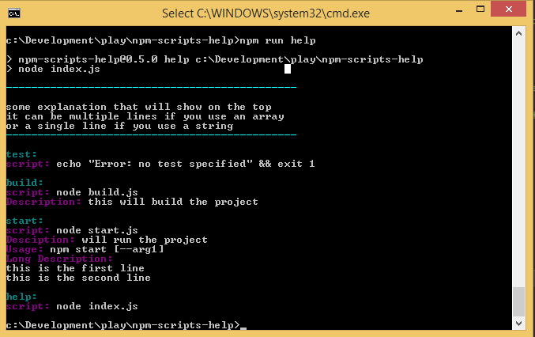

# npm-scripts-help
prints documentation for npm scripts.



## Install
```
npm i --save-dev npm-scripts-help
```

add help script to your package json's scripts

```
scripts:{
  "build" : "node build.js",
  "start": "node start.js",
  "help": "npm-scripts-help"
}

```

## Run
To see all scripts:
```
npm run help
```
to filter scripts:
```
npm run help [regex]
```

# Adding documentation to scripts:

There are 2 options :

## 1) Inside `package.json`
add a property called scriptshelp in the root of package.json like this:
```
"scriptshelp" : {
  "help-message" : [
    "some explanation that will show on the top",
    "it can be multiple lines if you use an array",
    "or a single line if you use a string"
  ],
  "build" :"this will build the project",
  "start" : {
    "Desciption": "will run the project",
    "Usage": "npm start [--arg1]",
    "Long Description" : [
      "this is the first line",
      "this is the second line"
    ]
  }
}
```

## 2) Create `.scriptshelprc.js` file
add a file in the root of the project, next to `package.json` called `.scriptshelprc.js` and export the scriptshelp object
```
module.exports = {
  "help-message" : [
    "some explanation that will show on the top",
    "it can be multiple lines if you use an array",
    "or a single line if you use a string"
  ],
  "build" :"this will build the project",
  "start" : {
    "Desciption": "will run the project",
    "Usage": "npm start [--arg1]",
    "Long Description" : [
      "this is the first line",
      "this is the second line"
    ]
  }
};
```


## scripts help object syntax
* scriptshelp must be an object.
* "help-message" is a special property that will show a general message before the scripts docs.
* add a key with a name matching any script you have in your npm scripts.    
values can be strings for single line description, arrays for multiline or objects.    
objects can contain any key as long as their value is a string or a string array.


